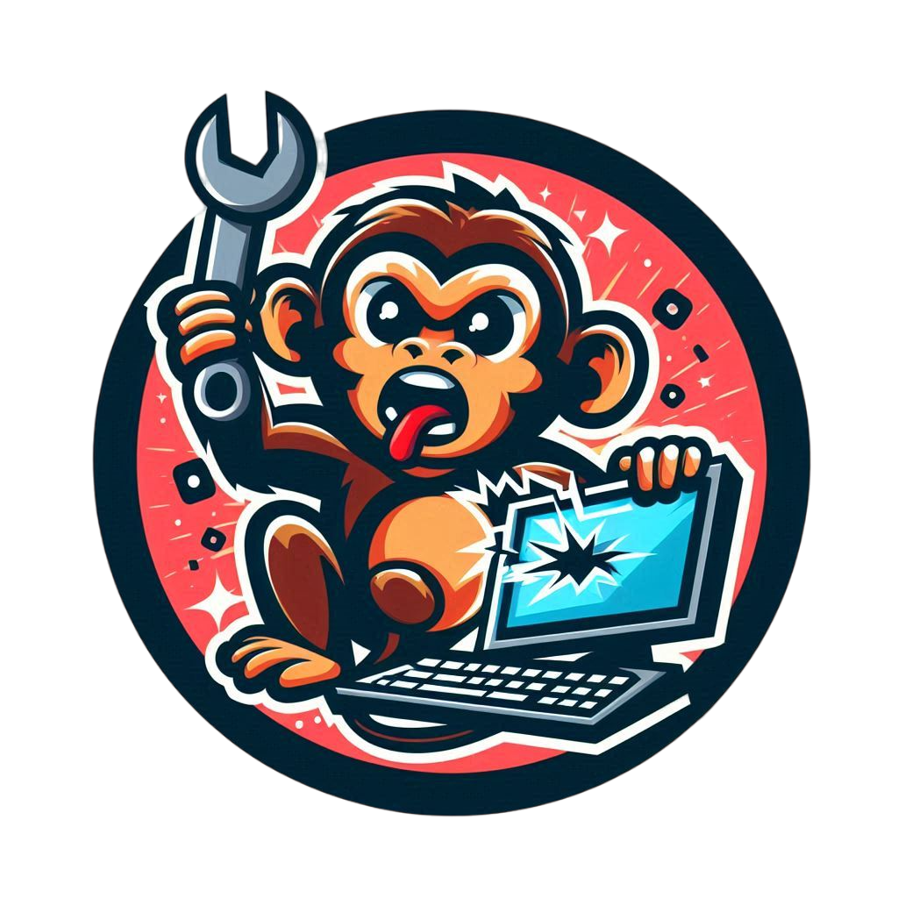
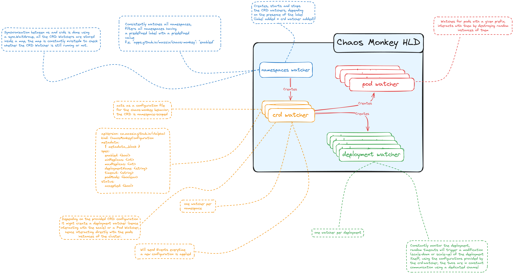

<div align="center">
  
</div>

# Chaos Monkey
This small project written using [Golang](https://go.dev) implements the ideas of the
[Netflix's Chaos Monkey](https://netflix.github.io/chaosmonkey/) natively for
[Kubernetes](https://kubernetes.io) clusters.

For this small project I have decided not to use the official
[Operator Framework for Golang](https://sdk.operatorframework.io/docs/building-operators/golang/tutorial/),
mainly because I wanted to familiarize with the core concepts of CRDs and Watchers with Golang
before adventuring further. In the future I might want to migrate to using the Operator Framework.

## Architecture
The architecture of the Chaos Monkey is fairly simple and all fits in a single Pod.
As you can imagine, we rely heavily on
[Kubernetes' API](https://kubernetes.io/docs/reference/using-api/api-concepts/) to react
based on what happens inside the cluster.

Three main components are part of the current architecture.

<div align="center">
  
</div>

### Namespace Watcher
The code for the `NamespaceWatcher` can be found [here](./internal/watcher/namespace.go).
Its role is to constantly monitor the changes in the Namespaces of the cluster, and start
the CRD Watchers for those Namespaces. We start the watch by passing `ResourceVersion: ""`
to the Kubernetes API, which means that the first events we receive are synthetic events
(`ADD`) to help us rebuild the current state of the cluster. After that, we react to both
the `ADDED` and the `DELETED` events accordingly.

Basically, it spawns a new [goroutine](https://go.dev/tour/concurrency/1) with a
[CRD Watcher](#crd-watcher) everytime a new namespace is detected and it stops the
corresponding goroutine when a namespace is deleted.

### CRD Watcher
We make use of a
[Custom Resource Definition (CRD)](https://kubernetes.io/docs/concepts/extend-kubernetes/api-extension/custom-resources/)
in order to trigger the Chaos Monkey. The CRD is defined using the
[OpenAPI](https://www.openapis.org/) specification, which you can find
[here](./crds/chaosmonkey-configuration.yaml).

Following the schema, this is a valid definition of a CRD which can be injected inside of
a namespace:

```yaml
apiVersion: cm.massix.github.io/v1alpha1
kind: ChaosMonkeyConfiguration
metadata:
  name: chaosmonkey-nginx
  namespace: target
spec:
  enabled: true
  minReplicas: 0
  maxReplicas: 9
  timeout: 10s
  deploymentName: nginx
```

The CRD is **namespaced**, meaning that it **must** reside inside a Namespace and cannot be
created at cluster-level.

The CRD Watcher, similarly to the [namespace one](#namespace-watcher), reacts to the
`ADDED` and `DELETED` events accordingly, creating and stopping goroutines, but it also
reacts to the `MODIFIED` event, making it possible to modify a configuration while the
Monkey is running.

### Deployment Watcher
This is where the fun begins, the Deployment Watcher is responsible of creating the
Chaos inside the cluster. The watcher is associated to a specific deployment (see the
example CRD above), and at regular intervals, specified by the `spec.timeout` field
of the CRD, it scales up or down the deployment. This allows us to test both the case
where there are less replicas than we need, but also the case when there are more
replicas than the cluster can probably handle.

All the fields in the CRDs are mandatory and **must** be set. There are some simple
validations done by Kubernetes itself, which are embedded in the
[OpenAPI Schema](./crds/chaosmonkey-configuration.yaml) and some other validations
are done in the code.

## Deployment inside a Kubernetes Cluster
In order to be able to deploy the ChaosMonkey inside a Kubernetes cluster you **must**
first create a [ServiceAccount](https://kubernetes.io/docs/concepts/security/service-accounts/),
followed by a [ClusterRole](https://kubernetes.io/docs/reference/access-authn-authz/rbac/)
and bind the two together with a [ClusterRoleBinding](https://kubernetes.io/docs/reference/access-authn-authz/rbac/#rolebinding-and-clusterrolebinding).

After that you need to inject the CRD contained in this repository:

    kubectl apply -f ./crds/chaosmonkey-configuration.yaml

Then you can create a classic [Deployment](https://kubernetes.io/docs/concepts/workloads/controllers/deployment/),
just remember to use your newly created ServiceAccount.

Following is an example of the manifests you *should* create for the cluster:

```yaml
kind: Namespace
apiVersion: v1
metadata:
  name: chaosmonkey
---
kind: ServiceAccount
apiVersion: v1
metadata:
  name: chaosmonkey
  namespace: chaosmonkey
---
kind: ClusterRole
apiVersion: rbac.authorization.k8s.io/v1
metadata:
  name: chaosmonkey
rules:
  - apiGroups: ["*"]
    resources: ["namespaces"]
    verbs: ["watch"]
  - apiGroups: ["*"]
    resources: ["deployments"]
    verbs: ["patch", "get", "scale", "update"]
  - apiGroups: ["*"]
    resources: ["chaosmonkeyconfigurations"]
    verbs: ["list", "patch", "watch"]
  - apiGroups: ["apps"]
    resources: ["deployments/scale"]
    verbs: ["update"]
  - apiGroups: ["*"]
    resources: ["events"]
    verbs: ["create", "patch"]
---
kind: ClusterRoleBinding
apiVersion: rbac.authorization.k8s.io/v1
metadata:
  name: chaosmonkey-binding
subjects:
  - kind: ServiceAccount
    name: chaosmonkey
    namespace: chaosmonkey
roleRef:
  kind: ClusterRole
  apiGroup: rbac.authorization.k8s.io
  name: chaosmonkey
---
kind: Deployment
apiGroup: apps/v1
metadata:
  name: chaosmonkey
  namespace: chaosmonkey
spec:
  # some fields omitted for clarity
  template:
    spec:
      serviceAccountName: chaosmonkey
```

## Configuration
The only configuration possible for the ChaosMonkey is setting the minimum log level,
this is done by setting the environment variable `CHAOSMONKEY_LOGLEVEL` to one of the
following values: `trace`, `debug`, `info`, `warn`, `error`, `critical` or `panic`.

The value is not case-sensitive.

Invalid or empty values will make ChaosMonkey default to the `info` level.

## Development
All contributions are welcome, of course. Feel free to open an issue or submit a
pull request. If you want to develop and test locally, you need to install:
- [Golang](https://go.dev) version 1.22 (it should probably work with older versions too, but this is the version I have used)
- [Docker](https://www.docker.com), latest version but any version will be fine
- [Terraform](https://www.terraform.io) at least version 1.8.5
- [Kind](https://github.com/kubernetes-sigs/kind) at least version 0.5.0
- [Kubectl](https://kubernetes.io/docs/tasks/tools/) at least version 1.30.1

The reason why you need so many tools, is because there is an embedded
[terraform file](./main.tf) which spawns a Kubernetes cluster in your local machine
using Kind, injects the CRD, builds the image and gives you a working environment
to test your development. There are some unit tests included, but since all the
interactions with Kubernetes are mocked, we cannot be sure that everything will
work once deployed.
