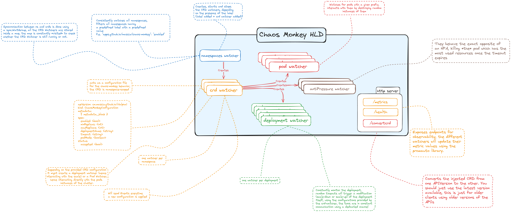

# Chaos Monkey

<div align="center">
  
</div>

[Golang](https://go.dev) implementation of the ideas of [Netflix's Chaos Monkey](https://netflix.github.io/chaosmonkey/) natively for [Kubernetes](https://kubernetes.io) clusters.

For this small project I have decided not to use the official [Operator Framework for Golang](https://sdk.operatorframework.io/docs/building-operators/golang/tutorial/),
mainly because I wanted to familiarize with the core concepts of CRDs and Watchers with Golang
before adventuring further. In the future I might want to migrate to using the Operator Framework.

## Architecture
The architecture of the Chaos Monkey is fairly simple and all fits in a single Pod.
As you can imagine, we rely heavily on [Kubernetes' API](https://kubernetes.io/docs/reference/using-api/api-concepts/) to react based on what happens inside the cluster.

Four main components are part of the current architecture.

<div align="center">
  
</div>

### Namespace Watcher
The code for the `NamespaceWatcher` can be found [here](./internal/watcher/namespace.go).

Its role is to constantly monitor the changes in the Namespaces of the cluster, and start
the CRD Watchers for those Namespaces. We start the watch by passing `ResourceVersion: ""`
to the Kubernetes API, which means that the first events we receive are synthetic events
(`ADD`) to help us rebuild the current state of the cluster. After that, we react to both
the `ADDED` and the `DELETED` events accordingly.

Basically, it spawns a new [goroutine](https://go.dev/tour/concurrency/1) with a [CRD Watcher](#crd-watcher) every time a new namespace is
detected and it stops the corresponding goroutine when a namespace is deleted.

The Namespace can be [configured](#configuration) to either monitor all namespaces by default (with an
opt-out strategy) or to monitor only the namespaces which contain the label
`cm.massix.github.io/namespace="true"`.

Check the [Configuration](#configuration) paragraph for more details.

### CRD Watcher
We make use of a [Custom Resource Definition (CRD)](https://kubernetes.io/docs/concepts/extend-kubernetes/api-extension/custom-resources/) in order to trigger the Chaos Monkey.
The CRD is defined using the [OpenAPI](https://www.openapis.org/) specification, which you can find [here](./crds/chaosmonkey-configuration.yaml).

Following the schema, this is a valid definition of a CRD which can be injected inside
of a namespace:

```yaml
apiVersion: cm.massix.github.io/v1
kind: ChaosMonkeyConfiguration
metadata:
  name: chaosmonkey-nginx
  namespace: target
spec:
  enabled: true
  minReplicas: 0
  maxReplicas: 9
  timeout: 10s
  deployment:
    name: nginx
  scalingMode: killPod
```

The CRD is **namespaced**, meaning that it **must** reside inside a Namespace and cannot be
created at cluster-level.

The CRD Watcher, similarly to the [namespace one](#namespace-watcher), reacts to the
`ADDED` and `DELETED` events accordingly, creating and stopping goroutines, but it also
reacts to the `MODIFIED` event, making it possible to modify a configuration while the
Monkey is running.

Depending on the value of the `scalingMode` flag, the CRD watcher will either create a
[DeploymentWatcher](#deployment-watcher) or a [PodWatcher](#pod-watcher) The difference between
the two is highlighted in the right paragraph, but in short: the DeploymentWatcher
operates by modifying the `spec.replicas` field of the Deployment, using the
`deployment/scale` APIs, while the PodWatcher simply deletes a random pod using the
same `spec.selector` value of the targeted Deployment.

As of now, three values are supported by the `scalingMode` field:
* `randomScale`, which will create a [DeploymentWatcher](#deployment-watcher), it will randomly modify the scales of the given deployment;
* `killPod`, which will create a [PodWatcher](#pod-watcher), it will randomly kill a pod;
* `antiPressure`, do not use it because it's not implemented yet.

### Deployment Watcher
This is where the fun begins, the Deployment Watcher is responsible of creating the
Chaos inside the cluster. The watcher is associated to a specific deployment (see the
example CRD above), and at regular intervals, specified by the `spec.timeout` field
of the CRD, it scales up or down the deployment. This allows us to test both the case
where there are less replicas than we need, but also the case when there are more
replicas than the cluster can probably handle.

All the fields in the CRDs are mandatory and **must** be set. There are some simple
validations done by Kubernetes itself, which are embedded in the
[OpenAPI Schema](./crds/chaosmonkey-configuration.yaml) and some other validations
are done in the code.

### Pod Watcher
This is another point where the fun begins. The Pod Watcher is responsible of
creating the Chaos inside the cluster. The watcher is associated with a specific
`spec.selector` field, and at regular intervals, specified by the `spec.timeout` field
of the CRD, it will randomly kill a pod matching the field.

The Pod Watcher **ignores** the `maxReplicas` and `minReplicas` fields of the CRD,
thus generating real chaos inside the cluster.

## Deployment inside a Kubernetes Cluster
In order to be able to deploy the ChaosMonkey inside a Kubernetes cluster you **must**
first create a [ServiceAccount](https://kubernetes.io/docs/concepts/security/service-accounts/),
followed by a [ClusterRole](https://kubernetes.io/docs/reference/access-authn-authz/rbac/)
and bind the two together with a [ClusterRoleBinding](https://kubernetes.io/docs/reference/access-authn-authz/rbac/#rolebinding-and-clusterrolebinding).

After that you need to inject the CRD contained in this repository:

    kubectl apply -f ./crds/chaosmonkey-configuration.yaml

Then you can create a classic [Deployment](https://kubernetes.io/docs/concepts/workloads/controllers/deployment/),
just remember to use your newly created ServiceAccount.

Following is an example of the manifests you *should* create for the cluster:

```yaml
kind: Namespace
apiVersion: v1
metadata:
  name: chaosmonkey
---
kind: ServiceAccount
apiVersion: v1
metadata:
  name: chaosmonkey
  namespace: chaosmonkey
---
kind: ClusterRole
apiVersion: rbac.authorization.k8s.io/v1
metadata:
  name: chaosmonkey
rules:
  - verbs: ["watch"]
    resources: ["namespaces"]
    apiGroups: ["*"]
  - verbs: ["patch", "get", "scale", "update"]
    resources: ["deployments"]
    apiGroups: ["*"]
  - verbs: ["list", "patch", "watch"]
    resources: ["chaosmonkeyconfigurations"]
    apiGroups: ["*"]
  - verbs: ["update"]
    resources: ["deployments/scale"]
    apiGroups: ["apps"]
  - verbs: ["watch", "delete"]
    resources: ["pods"]
    apiGroups: ["*"]
  - verbs: ["create", "patch"]
    resources: ["events"]
    apiGroups: ["*"]
---
kind: ClusterRoleBinding
apiVersion: rbac.authorization.k8s.io/v1
metadata:
  name: chaosmonkey-binding
subjects:
  - kind: ServiceAccount
    name: chaosmonkey
    namespace: chaosmonkey
roleRef:
  kind: ClusterRole
  apiGroup: rbac.authorization.k8s.io
  name: chaosmonkey
---
kind: Deployment
apiGroup: apps/v1
metadata:
  name: chaosmonkey
  namespace: chaosmonkey
spec:
  # some fields omitted for clarity
  template:
    spec:
      serviceAccountName: chaosmonkey
```

## A note on CRD
The CRD defines multiple versions of the APIs (at the moment two versions are supported:
`v1alpha1` and `v1`). You should **always** use the latest version available (`v1`), but
there is a conversion endpoint in case you are still using the older version of the API.

The only caveat is that if you **need** to use the conversion Webhook, you **must** install the
chaosmonkey in a namespace named `chaosmonkey` and create a service named `chaos-monkey`
for it.

If in doubt, do not use the older version of the API.

## Configuration
There are some configurable parts of the ChaosMonkey (on top of what the [CRD](./crds/chaosmonkey-configuration.yaml)
already permits of course).

**Minimum Log Level**: this is configurable using the environment variable `CHAOSMONKEY_LOGLEVEL`,
it accepts the following self explaining values: `trace`, `debug`, `info`, `warn`, `error`,
`critical` or `panic` and it sets the minimum log level for all the logging of the ChaosMonkey.

The value is not case-sensitive, invalid or empty values will make ChaosMonkey default to
the `info` level.

**Default Behavior**: this is used to configure the way the [Namespace Watcher](#namespace-watcher) should
behave in regards of additions and modifications of namespaces and it uses the environment
variable `CHAOSMONKEY_BEHAVIOR`. It currently accepts two values: `AllowAll` or `DenyAll`
(not case sensitive).

Setting it to `AllowAll` means that by default all namespaces are monitored, if
you want to opt-out a namespace you **must** create a new label in the
metadata of the namespace: `cm.massix.github.io/namespace="false"`, this will
make the Watcher ignore that namespace. All values which are not the string
`false` will cause the Watcher to take that namespace into account.

Setting it to `DenyAll` means that by default all namespaces are ignored, if
you want to opt-in a namespace you **must** create a new label in
the metadata of the namespace: `cm.massix.github.io/namespace="true"`, this will
make the Watcher take that namespace into account. All values which are not
the string `true` will cause the Watcher to ignore that namespace.

Injecting an incorrect value or no value at all will have ChaosMonkey use its
default behavior: `AllowAll`.

**Watchers Timeout**: not to be confused with the timeout provided by the [CRD](#deployment-inside-a-kubernetes-cluster), this is merely a
technical value, it is the timeout for the `watch` method in Kubernetes. The default value
is of 48 hours, which should be good for whatever kind of cluster you are running, but
if you want to increase or decrease it you have three different environment
variables you can use:
- `CHAOSMONKEY_NS_TIMEOUT` to configure the timeout for the [Namespace Watcher](#namespace-watcher)
- `CHAOSMONKEY_CRD_TIMEOUT` to configure the timeout for the [CRD Watcher](#crd-watcher)
- `CHAOSMONKEY_POD_TIMEOUT` to configure the timeout for the [Pod Watcher](#pod-watcher).

The three environment values expect a string following the specification of the [`time.ParseDuration`](https://pkg.go.dev/time#ParseDuration)
method of Golang. Failure in parsing a value will have Chaos Monkey use the
default timeout of 48 hours.

It is recommended not to touch these values unless you know what you are doing (spoiler: I do not
know what I am doing most of the times).

## Observability
The Chaos Monkey has two observability endpoints available, both exposed by the HTTP server
running at port 9000 (not configurable).

### Prometheus
The Chaos Monkey exposes some metrics using the [Prometheus](https://prometheus.io/) library and format, the metrics are all
available under the `/metrics` endpoint.

This is an _evolving_ list of metrics currently exposed, for more details please take a look
in the code under the corresponding service (all the services in the [watcher folder](./internal/watcher/) expose
some sort of metrics).

All the events use the prefix `chaos_monkey` which, for readability issues, is not repeated in the
table below.

| Name                                   | Description                             | Type      |
|----------------------------------------|-----------------------------------------|-----------|
| nswatcher_events                       | events handled by the nswatcher         | Counter   |
| nswatcher_event_duration               | duration of each event in microseconds  | Histogram |
| nswatcher_cmc_spawned                  | crd services spawned                    | Counter   |
| nswatcher_cmc_active                   | currently active crd                    | Gauge     |
| nswatcher_restarts                     | timeouts happened from K8S APIs         | Counter   |
| crdwatcher_events                      | events handled by the crd watcher       | Counter   |
| crdwatcher_pw_spawned                  | PodWatchers spawned                     | Counter   |
| crdwatcher_pw_active                   | PodWatchers currently active            | Gauge     |
| crdwatcher_dw_spawned                  | DeploymentWatchers spawned              | Counter   |
| crdwatcher_dw_active                   | DeploymentWatchers active               | Gauge     |
| crdwatcher_restarts                    | timeouts happened from K8S APIs         | Counter   |
| podwatcher_pods_added                  | Pods having been added to the list      | Counter   |
| podwatcher_pods_removed                | Pods having been removed from the list  | Counter   |
| podwatcher_pods_killed                 | Pods having been killed                 | Counter   |
| podwatcher_pods_active                 | Pods currently being targeted           | Gauge     |
| podwatcher_restarts                    | timeouts happened from K8S APIs         | Counter   |
| deploymentwatcher_deployments_rescaled | deployments having been rescaled        | Counter   |
| deploymentwatcher_random_distribution  | random distribution of deployments      | Histogram |
| deploymentwatcher_last_scale           | last value used to scale the deployment | Gauge     |

In the [Makefile](./Makefile) there is also a target `deploy-monitoring` used to deploy a very
bare bone and simple monitoring stack which includes your classic Prometheus and Grafana, with
no persistence enabled.  The Grafana will be loaded with three dashboards:
- `node-exporter-full` to have some live statistics about your locally running K8S cluster;
- `kube-state-metrics-v2` to have some statistics about the internals of K8S, useful to monitor how the ChaosMonkey is behaving;
- `chaos-monkey`, for which the source is available [here](./assets/grafana-dashboard.json) and exploits some of the metrics of the table above.

### Health Endpoint
On top of Prometheus, there is also an endpoint available at `/health`, which gives some very
basic information about the state of the Chaos Monkey. It can be used in Kubernetes for the
[liveness and readiness probe](https://kubernetes.io/docs/tasks/configure-pod-container/configure-liveness-readiness-startup-probes/).

## Development
All contributions are welcome, of course. Feel free to open an issue or submit a
pull request. If you want to develop and test locally, you need to install:
- [Golang](https://go.dev) version 1.22 (it should probably work with older versions too, but this is the version I have used)
- [Docker](https://www.docker.com), latest version but any version will be fine
- [Terraform](https://www.terraform.io) at least version 1.8.5
- [Kind](https://github.com/kubernetes-sigs/kind) at least version 0.5.0
- [Kubectl](https://kubernetes.io/docs/tasks/tools/) at least version 1.30.1

### Unit Tests
The project includes a wide variety of unit tests, which are using the `fake` client
of kubernetes included in the `client-go` library. The problem is that when testing
with mocks, most of the times you end up testing the mocks and not the code. That's
the reason why there are also some [integration tests](#integration-tests) included.

### Integration Tests
These tests should cover the basic functionalities of the Chaos Monkey in a local
Kubernetes cluster. The script file is [here](./tests/kubetest.sh) and before launching
it you should create the Kubernetes cluster locally, using the included [Terraform](./main.tf) configuration.

It should be as easy as launching:

    $ make cluster-test
    $ ./tests/kubetest.sh

You can also activate a more verbose logging for the tests with

    TEST_DEBUG=true ./tests/kubetest.sh
